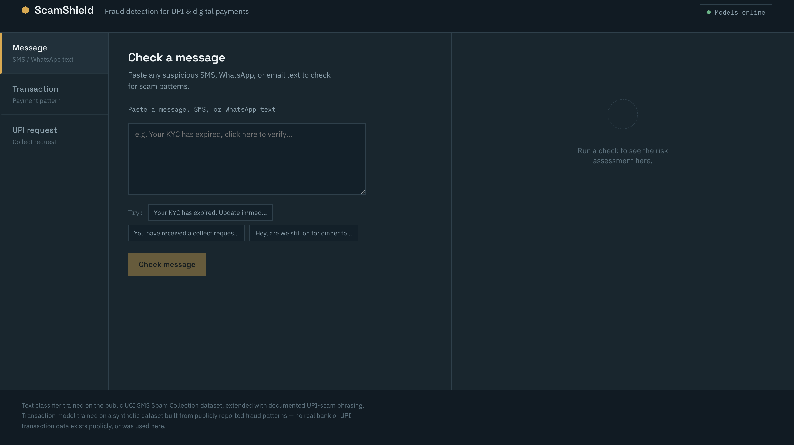

# ScamShield — UPI & Digital Payment Fraud Detection

**[▶ Try the live demo](https://scamshield-cyan.vercel.app)** &nbsp;·&nbsp; [API docs](https://scamshield-9ksh.onrender.com/docs) &nbsp;·&nbsp; [Browser extension](extension/)




> **Note:** the backend runs on Render's free tier, which sleeps after inactivity.
> The first request can take up to a minute to wake it — after that it's fast.

A full-stack app that assesses scam/fraud risk across three common attack surfaces in
Indian digital payments: suspicious **messages** (SMS/WhatsApp phishing), **transaction
patterns** (behavioural anomalies), and **UPI collect requests** (the "approve to receive
money" trick).

It combines two trained ML models with an explicit rule engine, and returns a risk score
**with a plain-language explanation** of why something was flagged — not just a number.

## Why this project

Digital payment fraud in India has grown alongside UPI adoption, and most protection is
reactive (banks flag fraud *after* the money is gone) rather than preventive. This project
is a prototype of a preventive layer: catching a scam message or a suspicious request
*before* the user acts on it.

## Try it

Open the [live demo](https://scamshield-cyan.vercel.app) and paste one of these into the **Message** tab:

| Input | Expected |
|---|---|
| `Your KYC will expire today. Click http://bit.ly/kyc-verify to update.` | High risk — urgency + shortened link |
| `Hey, are we still on for lunch at 1?` | Low risk — no scam patterns |

Or hit the API directly:

```bash
curl -X POST https://scamshield-9ksh.onrender.com/predict/message \
  -H "Content-Type: application/json" \
  -d '{"text":"Your KYC will expire, click here to update"}'
```

## Architecture

```
┌─────────────┐      ┌──────────────────────────────────────────┐
│   React UI   │─────▶│  FastAPI backend                         │
│ (Vite)       │◀─────│  ┌────────────────┐  ┌──────────────────┐│
└─────────────┘      │  │ Text classifier │  │ Transaction       ││
                      │  │ (TF-IDF + LR)   │  │ anomaly model     ││
                      │  └────────────────┘  │ (Isolation Forest)││
                      │           │           └──────────────────┘│
                      │           ▼                                │
                      │  ┌────────────────────────────────────┐   │
                      │  │ Rule engine (explainable heuristics)│   │
                      │  └────────────────────────────────────┘   │
                      └──────────────────────────────────────────┘
```

- **Message classifier**: combined word (1-2 gram) + character (3-5 gram) TF-IDF features
  feeding a linear SVM (calibrated for probabilities), selected via 5-fold cross-validated
  comparison against Logistic Regression and Complement Naive Bayes. Trained on 6,840
  real, deduplicated messages from two public sources — the
  [UCI SMS Spam Collection](https://archive.ics.uci.edu/dataset/228/sms+spam+collection)
  (5,572 messages) and a
  [combined smishing research dataset](https://github.com/shaghayegh-hp/Smishing_Dataset)
  (a compilation of 5 public phishing-SMS sources, sampled here) — plus a small
  hand-curated set of UPI-scam phrasing patterns (fake KYC, fake refunds, "collect
  request" tricks) based on publicly documented RBI/CERT-In scam advisories.
- **Transaction risk model**: an unsupervised Isolation Forest, which catches
  statistically unusual transactions without needing labels. **No real UPI/bank transaction
  dataset exists publicly** — banks and NPCI don't release this data, for good reason.
  The model is trained on a **synthetic dataset** (21,200 rows) whose fraud-pattern
  logic (odd-hour transactions, new-payee targeting, transaction bursts, device-change
  correlation, amounts just under verification thresholds, spend far above the sender's
  usual pattern, repeated failed PIN/OTP attempts) is built from publicly documented
  fraud typologies, not real data, and evaluated on a proper held-out test split. See
  `backend/app/ml/train_transaction_model.py` for the exact generation logic — it's
  fully commented and disclosed there.
- **Rule engine**: explicit, auditable checks (known scam phrasing, suspicious URLs,
  collect-request red flags) that combine with the ML score. Real fraud systems are
  hybrid for a reason — rules catch known patterns instantly and are explainable in a way
  a pure ML score isn't.

## Project structure

```
scamshield/
├── backend/
│   ├── app/
│   │   ├── main.py                 # FastAPI app + endpoints
│   │   ├── ml/
│   │   │   ├── download_dataset.py     # fetches the real base dataset
│   │   │   ├── train_text_classifier.py
│   │   │   ├── train_transaction_model.py
│   │   │   ├── rules.py                # rule engine
│   │   │   └── predict.py              # combines ML + rules
│   │   ├── models/                 # trained model artifacts (generated, gitignored)
│   │   └── data/                   # datasets (generated/downloaded, gitignored)
│   └── requirements.txt
└── frontend/
    ├── src/
    │   ├── App.jsx
    │   ├── api.js
    │   └── components/
    └── package.json
```

## Setup

### 1. Backend

```bash
cd backend
python3 -m venv .venv
source .venv/bin/activate        # Windows: .venv\Scripts\activate
pip install -r requirements.txt

# Download the real base dataset, then train both models
python3 app/ml/download_dataset.py
python3 app/ml/train_text_classifier.py
python3 app/ml/train_transaction_model.py

# Run the API
uvicorn app.main:app --reload --port 8000
```

The API will be live at `http://localhost:8000`. Interactive docs at
`http://localhost:8000/docs`.

### 2. Frontend

```bash
cd frontend
npm install
echo "VITE_API_URL=http://localhost:8000" > .env
npm run dev
```

Open `http://localhost:5173`.

## API endpoints

| Endpoint | Method | Purpose |
|---|---|---|
| `/predict/message` | POST | Score a text message (`{"text": "..."}`) |
| `/predict/transaction` | POST | Score a transaction pattern |
| `/predict/upi-request` | POST | Score a UPI collect/payment request |

Each returns a `risk_score` (0–1), `risk_level` (`low`/`medium`/`high`), and a plain-language
`explanation`.

## Model performance (on held-out test data)

- **Text classifier**: 98% accuracy, 95% F1 on the scam class, 95% mean 5-fold CV F1
  on a held-out 20% test split. Trained on 6,840 deduplicated messages drawn from two
  real public datasets (11,543 before deduplication) plus the curated UPI-scam patterns,
  with the model chosen by 5-fold cross-validated comparison of three model types rather
  than picked by default.
- **Transaction model**: Isolation Forest evaluated against synthetic ground-truth
  labels (see caveat
  above — this is performance against the synthetic labels it was trained to detect, not a
  real-world benchmark).

## Does the rule layer actually help?

The hybrid design (ML + explicit rules) is a design claim, so it is measured rather
than asserted. Reproduce with `python app/ml/evaluate.py`.

Held-out test set: 1,368 messages, 287 scam.

| Variant | Precision | Recall | F1 | F2 | Missed scams | False alarms |
|---|---|---|---|---|---|---|
| ML only (0.50) | 0.952 | 0.958 | **0.955** | 0.957 | 12 | 14 |
| Rules only | 0.846 | 0.115 | 0.202 | 0.139 | 254 | 6 |
| Hybrid, deployed (0.35) | 0.929 | 0.962 | 0.945 | 0.955 | **11** | 21 |

**The hybrid scores slightly lower on F1 than the classifier alone.** That is worth
stating plainly rather than hiding: adding rules did not make the model more accurate
by that measure.

F1 is the wrong objective here, though. A missed scam can cost someone their savings;
a false alarm costs them a few seconds. F1 weights those equally. Weighting a missed
scam at 10x a false alarm, the hybrid comes out slightly ahead (131 vs 134) because it
catches one more scam for seven more false alarms.

The rules-only row is the more interesting one: precision 0.846 at recall 0.115. The
rules fire rarely, but they are usually right when they do — which is exactly what a
rule layer should be. Their real contribution is not accuracy but the
`triggered_rules` and `explanation` fields, which the classifier cannot produce.

### Threshold choice

| Threshold | Precision | Recall | F1 | Missed | False alarms | Cost* |
|---|---|---|---|---|---|---|
| 0.30 | 0.891 | 0.969 | 0.928 | 9 | 34 | **124** |
| 0.35 (deployed) | 0.929 | 0.962 | 0.945 | 11 | 21 | 131 |
| 0.40 | 0.968 | 0.958 | **0.963** | 12 | 9 | 129 |
| 0.70 | 1.000 | 0.631 | 0.774 | 106 | 0 | 1060 |

\* cost = missed scams x 10 + false alarms

The deployed threshold of 0.35 is not cost-optimal: 0.30 is cheaper under this
assumption. The gap is small, and the 10x multiplier is a judgement call rather than a
measured figure, so the threshold is left where it is and the trade-off is documented
here instead of being buried in a constant.

### How far does the transaction model actually generalize?

The transaction model is trained on synthetic data whose fraud patterns were written
by hand. Scoring it against those same patterns is circular — it measures re-detection
of a known signature, not fraud detection. So it is also tested against typologies the
generator never encoded (`python app/ml/test_generalization.py`):

| Fraud typology | Recall |
|---|---|
| In-generator (late-night, new payee, high payee risk) | **1.000** |
| Patient social-engineering (one normal-looking transfer) | 0.828 |
| Salami slicing (small, rapid transfers to a known clean payee) | **0.168** |
| *False-alarm rate on fresh legitimate traffic* | *0.046* |

**Near-perfect recall on the pattern it was designed around; 17% on one it was not.**

The failure had a specific cause rather than being general weakness. Isolation Forest
detects *point* anomalies — transactions unusual in the joint feature space. Salami
slicing is invisible to that: each individual transfer is unremarkable and only the
*sequence* is suspicious.

So the fix was a feature problem, not a model problem. The model now also receives
three features derived from a 24-hour per-payee window — transfer count, running
total, and this amount against the payee average:

| Fraud typology | Before | After |
|---|---|---|
| In-generator (late-night, new payee, high payee risk) | 1.000 | 1.000 |
| Patient social-engineering (one normal-looking transfer) | 0.828 | **0.978** |
| Salami slicing (small, rapid transfers to a known clean payee) | **0.168** | **1.000** |
| *False-alarm rate on fresh legitimate traffic* | *0.046* | *0.044* |

The blind spot closes without costing precision elsewhere.

**How the API gets this history.** `/predict/transaction` is stateless — it stores
nothing. Callers optionally pass `recent_payee_txns`, a list of `{amount, minutes_ago}`
for earlier transfers to the same payee; anything older than 24 hours is ignored. Omit
it and the endpoint behaves exactly as before, assuming this is the only transfer to
that payee rather than inventing a history.

That design is honest for a scoring service but not sufficient for a public one: a
caller could lower their own score simply by omitting history. A production deployment
would persist transaction history server-side and derive these features from its own
records rather than trusting the request.

## Deployment

**Backend (Render, free tier):**
1. Push this repo to GitHub (done, if you're reading this from there).
2. On [render.com](https://render.com), click **New → Web Service**, connect this repo.
3. Root directory: `backend`
4. Build command: `bash build.sh`
5. Start command: `uvicorn app.main:app --host 0.0.0.0 --port $PORT`
6. Deploy. Copy the resulting URL (e.g. `https://scamshield-api.onrender.com`).

**Frontend (Vercel, free tier):**
1. On [vercel.com](https://vercel.com), click **Add New → Project**, import this repo.
2. Root directory: `frontend`
3. Framework preset: Vite (auto-detected)
4. Add environment variable: `VITE_API_URL` = your Render backend URL from above.
5. Deploy.

**Then, back on Render**, set an `ALLOWED_ORIGINS` environment variable to your Vercel URL
(e.g. `https://scamshield.vercel.app`) so the backend only accepts requests from your live
frontend rather than any origin.

## Honest limitations

- The transaction model has never seen real transaction data and should not be presented
  as validated against real fraud — it's a prototype demonstrating the approach.
- The text classifier's base data is general 2011-era SMS spam; UPI-scam coverage comes
  from a small curated set (~24 examples), not a large labeled corpus of real UPI scams.
- This is a portfolio/learning project, not a production fraud-detection system. Don't use
  it as the sole safeguard for real financial decisions.

## Tech stack

- **Backend**: Python, FastAPI, scikit-learn, pandas
- **Frontend**: React, Vite
- **ML**: TF-IDF + Logistic Regression (text), Isolation Forest (anomaly detection)

## License

MIT
