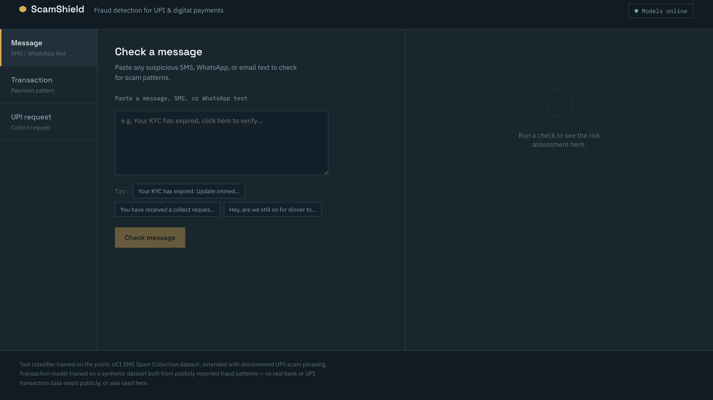

# ScamShield — UPI & Digital Payment Fraud Detection

**[▶ Try the live demo](https://scamshield-cyan.vercel.app)** &nbsp;·&nbsp; [API docs](https://scamshield-9ksh.onrender.com/docs) &nbsp;·&nbsp; [Browser extension](extension/)




> **Note:** the backend runs on Render's free tier, which sleeps after inactivity.
> The first request can take up to a minute to wake it — after that it's fast.

A full-stack app that assesses scam/fraud risk across three common attack surfaces in
Indian digital payments: suspicious **messages** (SMS/WhatsApp phishing), **transaction
patterns** (behavioural anomalies), and **UPI collect requests** (the "approve to receive
money" trick).

It combines two trained ML models with an explicit rule engine, and returns a risk score
**with a plain-language explanation** of why something was flagged — not just a number.

## Why this project

Digital payment fraud in India has grown alongside UPI adoption, and most protection is
reactive (banks flag fraud *after* the money is gone) rather than preventive. This project
is a prototype of a preventive layer: catching a scam message or a suspicious request
*before* the user acts on it.

## Try it

Open the [live demo](https://scamshield-cyan.vercel.app) and paste one of these into the **Message** tab:

| Input | Expected |
|---|---|
| `Your KYC will expire today. Click http://bit.ly/kyc-verify to update.` | High risk — urgency + shortened link |
| `Hey, are we still on for lunch at 1?` | Low risk — no scam patterns |

Or hit the API directly:

```bash
curl -X POST https://scamshield-9ksh.onrender.com/predict/message \
  -H "Content-Type: application/json" \
  -d '{"text":"Your KYC will expire, click here to update"}'
```

## Architecture

```
┌─────────────┐      ┌──────────────────────────────────────────┐
│   React UI   │─────▶│  FastAPI backend                         │
│ (Vite)       │◀─────│  ┌────────────────┐  ┌──────────────────┐│
└─────────────┘      │  │ Text classifier │  │ Transaction       ││
                      │  │ (TF-IDF + LR)   │  │ anomaly model     ││
                      │  └────────────────┘  │ (Isolation Forest)││
                      │           │           └──────────────────┘│
                      │           ▼                                │
                      │  ┌────────────────────────────────────┐   │
                      │  │ Rule engine (explainable heuristics)│   │
                      │  └────────────────────────────────────┘   │
                      └──────────────────────────────────────────┘
```

- **Message classifier**: word (1-2 gram) TF-IDF features feeding a Logistic Regression
  (class-balanced). Hindi (Devanagari) text is kept and tokenised as whole words, so
  Hindi messages are actually read rather than reduced to an empty string. Trained on 6,840
  real, deduplicated messages from two public sources — the
  [UCI SMS Spam Collection](https://archive.ics.uci.edu/dataset/228/sms+spam+collection)
  (5,572 messages) and a
  [combined smishing research dataset](https://github.com/shaghayegh-hp/Smishing_Dataset)
  (a compilation of 5 public phishing-SMS sources, sampled here) — plus a small
  hand-curated set of UPI-scam phrasing patterns (fake KYC, fake refunds, "collect
  request" tricks) based on publicly documented RBI/CERT-In scam advisories, plus 111
  hand-written Indian-context messages (Hinglish and Hindi scams, and the bank/UPI/OTP
  alerts the public datasets contain none of), added to the training split only.
- **Transaction risk model**: two models over the same features — an unsupervised
  Isolation Forest, which catches statistically unusual transactions without needing
  labels, and a supervised Random Forest, which learns the labelled fraud patterns and
  exposes interpretable feature importances. **No real UPI/bank transaction
  dataset exists publicly** — banks and NPCI don't release this data, for good reason.
  The model is trained on a **synthetic dataset** (21,200 rows) whose fraud-pattern
  logic (odd-hour transactions, new-payee targeting, transaction bursts, device-change
  correlation, amounts just under verification thresholds, spend far above the sender's
  usual pattern, repeated failed PIN/OTP attempts) is built from publicly documented
  fraud typologies, not real data, and evaluated on a proper held-out test split. See
  `backend/app/ml/train_transaction_model.py` for the exact generation logic — it's
  fully commented and disclosed there.
- **Rule engine**: explicit, auditable checks (known scam phrasing, suspicious URLs,
  collect-request red flags) that combine with the ML score. Real fraud systems are
  hybrid for a reason — rules catch known patterns instantly and are explainable in a way
  a pure ML score isn't.
- **QR code checker**: decodes a UPI QR from a photo or screenshot and shows who the
  money actually goes to. See "QR code checks" below.

## Project structure

```
scamshield/
├── backend/
│   ├── app/
│   │   ├── main.py                 # FastAPI app + endpoints
│   │   ├── ml/
│   │   │   ├── download_dataset.py     # fetches the real base dataset
│   │   │   ├── train_text_classifier.py
│   │   │   ├── evaluate.py             # rule-layer + threshold evaluation
│   │   │   ├── evaluate_indian.py      # Hinglish/Hindi/Indian-alert evaluation
│   │   │   ├── train_transaction_model.py
│   │   │   ├── rules.py                # rule engine
│   │   │   ├── upi_qr.py               # QR parsing (UPI links, Bharat QR) + rules
│   │   │   └── predict.py              # combines ML + rules
│   │   ├── models/                 # trained model artifacts (committed)
│   │   └── data/                   # datasets, incl. Indian train + eval sets (committed)
│   └── requirements.txt
└── frontend/
    ├── src/
    │   ├── App.jsx
    │   ├── api.js
    │   └── components/
    └── package.json
```

## Setup

### 1. Backend

```bash
cd backend
python3 -m venv .venv
source .venv/bin/activate        # Windows: .venv\Scripts\activate
pip install -r requirements.txt

# Download the real base dataset, then train both models
python3 app/ml/download_dataset.py
python3 app/ml/train_text_classifier.py
python3 app/ml/train_transaction_model.py

# Run the API
uvicorn app.main:app --reload --port 8000
```

The API will be live at `http://localhost:8000`. Interactive docs at
`http://localhost:8000/docs`.

### 2. Frontend

```bash
cd frontend
npm install
echo "VITE_API_URL=http://localhost:8000" > .env
npm run dev
```

Open `http://localhost:5173`.

## API endpoints

| Endpoint | Method | Purpose |
|---|---|---|
| `/health` | GET | Actually loads every model artifact and returns 503 if any fail - used as Render's deploy health check, not just "is the process up" |
| `/predict/message` | POST | Score a text message (`{"text": "..."}`) |
| `/predict/transaction` | POST | Score a transaction pattern |
| `/predict/upi-request` | POST | Score a UPI collect/payment request |
| `/predict/upi-qr` | POST | Score a decoded UPI QR code (`{"raw": "upi://pay?...", "expecting_to_receive": false}`) |

Each returns a `risk_score` (0–1), `risk_level` (`low`/`medium`/`high`), and a plain-language
`explanation`.

### QR code checks

The commonest QR scam needs no clever QR at all. A fake buyer on OLX, or a fake
"refund desk", sends an ordinary payment QR and says *scan this to receive your money*.
Scanning a UPI QR and entering your PIN always **sends** money - it never receives it.
That fact lives in what the victim was told, not in the QR, so the checker asks one
question - "What were you told this QR is for?" - and an answer of "to receive money"
is scored high on its own.

The QR's contents add further rule-based signals: refund/cashback/prize bait in the
payee name or UPI ID, a bank or government name attached to a personal phone-number UPI
ID, a payment note that promises the scanner money, a token "verification" amount, an
autopay mandate (`upi://mandate`) disguised as a payment, a non-rupee currency, a
missing UPI ID, or a QR that is actually a link. Both UPI deep links and EMVCo / Bharat
QR merchant codes (nested TLV) are parsed.

The image is decoded in the browser with [jsQR](https://github.com/cozmo/jsQR), so the
photo never leaves the user's phone; only the decoded text is sent to the API. Decoding
was tested on real images: a plain QR, a small QR inside a full-size phone screenshot,
a rotated and blurred 12-megapixel camera photo, a Bharat QR merchant code, and an image
with no QR in it. These are rules, not a trained model - there is no public dataset of
scam QR codes to train or evaluate one on.

### Transaction model inputs

`/predict/transaction` uses 13 features. The first 8 are supplied directly on the request;
the last 3 are derived server-side from an optional `recent_payee_txns` list
(`[{amount, minutes_ago}, ...]`) and exist specifically to catch patterns spread across
several transactions, like many small transfers to one payee, that a single transaction
looked at in isolation can't reveal.

| Feature | Source | Random Forest importance |
|---|---|---|
| `time_since_last_txn_min` | request | 0.239 — strongest single predictor |
| `payee_total_24h` | derived from `recent_payee_txns` | 0.206 — the most useful derived signal |
| `txns_last_hour` | request | 0.195 |
| `payee_risk_score` | request | 0.116 |
| `amount` | request | 0.076 |
| `amount_to_avg_ratio` | request | 0.068 — the caller's own estimate |
| `payee_txn_count_24h` | derived from `recent_payee_txns` | 0.060 |
| `hour` | request | 0.016 |
| `recent_failed_attempts` | request | 0.012 |
| `amount_to_payee_avg_ratio` | derived from `recent_payee_txns` | 0.006 — weaker than the manual `amount_to_avg_ratio` above it, despite being the "precise" computed version; measured, not assumed |
| `is_new_payee` | request | 0.004 |
| `device_changed_recently` | request | 0.003 |
| `is_weekend` | request | 0.0001 — negligible, a candidate for dropping |

Importances measured directly from the deployed Random Forest
(`model.feature_importances_`), not estimated.

## Model performance (on held-out test data)

- **Text classifier**: 98.5% accuracy and 0.963 F1 on the scam class on a held-out 20%
  test split of 1,368 messages. Trained on 6,840 deduplicated messages drawn from two
  real public datasets (11,543 before deduplication) plus the curated UPI-scam patterns
  and the Indian training set. These numbers say little about Indian users, since the
  test split is mostly English spam - see "How does it do on Indian messages?" below.
- **Transaction model**: on a held-out split of the synthetic data, the Isolation
  Forest scores 0.79 F1 on the fraud class (0.98 precision, 0.67 recall) and the Random
  Forest scores 1.00. **The Random Forest's perfect score is a warning, not a result:**
  it is learning fraud patterns that were written by hand in the generator, so it is
  measuring re-detection of a known signature. The Isolation Forest's weaker score is
  arguably the more honest number, since it never sees the labels. See the
  generalization section below for what happens against typologies the generator never
  encoded.

  Top feature importances (Random Forest): `time_since_last_txn_min` (0.24),
  `txns_last_hour` (0.19), `payee_risk_score` (0.12), `amount` (0.08). Notably
  `is_weekend` contributes almost nothing (0.0001) — a feature worth dropping on
  evidence rather than intuition.


## Does the rule layer actually help?

The hybrid design (ML + explicit rules) is a design claim, so it is measured rather
than asserted. Reproduce with `python app/ml/evaluate.py`.

Held-out test set: 1,368 messages, 287 scam.

| Variant | Precision | Recall | F1 | F2 | Missed scams | False alarms |
|---|---|---|---|---|---|---|
| ML only (0.50) | 0.965 | 0.962 | **0.963** | 0.962 | 11 | 10 |
| Rules only | 0.846 | 0.115 | 0.202 | 0.139 | 254 | 6 |
| Hybrid, deployed (0.35) | 0.949 | 0.969 | 0.959 | 0.965 | **9** | 15 |

**The hybrid scores slightly lower on F1 than the classifier alone.** That is worth
stating plainly rather than hiding: adding rules did not make the model more accurate
by that measure.

F1 is the wrong objective here, though. A missed scam can cost someone their savings;
a false alarm costs them a few seconds. F1 weights those equally. Weighting a missed
scam at 10x a false alarm, the hybrid comes out ahead (105 vs 120) because it
catches two more scams for five more false alarms.

The rules-only row is the more interesting one: precision 0.846 at recall 0.115. The
rules fire rarely, but they are usually right when they do — which is exactly what a
rule layer should be. Their real contribution is not accuracy but the
`triggered_rules` and `explanation` fields, which the classifier cannot produce.

### Threshold choice

| Threshold | Precision | Recall | F1 | Missed | False alarms | Cost* |
|---|---|---|---|---|---|---|
| 0.30 | 0.912 | 0.976 | 0.943 | 7 | 27 | **97** |
| 0.35 (deployed) | 0.949 | 0.969 | 0.959 | 9 | 15 | 105 |
| 0.40 | 0.969 | 0.965 | **0.967** | 10 | 9 | 109 |
| 0.70 | 0.995 | 0.669 | 0.800 | 95 | 1 | 951 |

\* cost = missed scams x 10 + false alarms

The deployed threshold of 0.35 is not cost-optimal: 0.30 is cheaper under this
assumption. The gap is small, and the 10x multiplier is a judgement call rather than a
measured figure, so the threshold is left where it is and the trade-off is documented
here instead of being buried in a constant.

## How does it do on Indian messages?

The held-out test split above is drawn from the same sources as training - mostly
English SMS spam from 2011. Scoring well there says little about what ScamShield's users
actually receive: Hinglish and Hindi scams, and a daily stream of legitimate bank, UPI
and OTP alerts. So it is measured separately on an 82-message Indian evaluation set
(`app/data/indian_eval_set.csv`). Reproduce with `python app/ml/evaluate_indian.py -v`.

Measured on that set at the deployed 0.35 threshold:

| | Before | After |
|---|---|---|
| Hinglish scams caught | 65% | **100%** |
| Hindi scams caught | 10% | **100%** |
| Indian-English scams caught | 100% | 100% |
| Bank / UPI alerts falsely flagged | 100% | 60% |
| OTP messages falsely flagged | 88% | 25% |
| Delivery / recharge / IRCTC / ITR falsely flagged | 62% | 62% |
| **All scams caught** | **60%** | **100%** |
| **All legitimate messages falsely flagged** | **52%** | **31%** |

The "before" numbers had three separate causes, each fixed and measured on its own:

1. `clean_text` stripped everything outside `a-z`, so every Hindi message reached the
   model as an empty string and scored an identical 0.09. Fixing that alone changed
   nothing, because of the next cause:
2. sklearn's default token pattern splits Devanagari words at vowel signs ("बिजली"
   became "जल"), and the training data contained no Hindi or Hinglish at all. Fixed with
   a Devanagari-aware token pattern plus 111 Indian training messages. Scam recall went
   from 60% to 100%; the main test split was unaffected (hybrid F1 0.958 to 0.959).
3. The `credential_request` rule fired on any mention of "otp", so every genuine "Your
   OTP is 4821, do not share it" message was flagged. It now fires only when someone is
   asked to share or send an OTP, after negated warnings are removed. OTP false alarms
   fell from 62% to 25%.

**Caveats, stated plainly.** Both the Indian training set and the evaluation set were
written by the same author, from the same scam typologies, so 100% recall here is
almost certainly optimistic - real scams will use phrasings neither set contains. The
two sets are kept strictly separate (the evaluation set is never trained on), but they
are not independent the way real-world data would be. And 31% of legitimate Indian
messages are still flagged: bank alerts share vocabulary ("Rs", "A/c", "call") with the
spam the model learned from. The fix for that is more real legitimate Indian alerts in
training, not further tuning against this evaluation set.

### How far does the transaction model actually generalize?

The transaction model is trained on synthetic data whose fraud patterns were written
by hand. Scoring it against those same patterns is circular — it measures re-detection
of a known signature, not fraud detection. So it is also tested against typologies the
generator never encoded (`python app/ml/test_generalization.py`):

| Fraud typology | Recall |
|---|---|
| In-generator (late-night, new payee, high payee risk) | **1.000** |
| Patient social-engineering (one normal-looking transfer) | 0.828 |
| Salami slicing (small, rapid transfers to a known clean payee) | **0.168** |
| *False-alarm rate on fresh legitimate traffic* | *0.046* |

**Near-perfect recall on the pattern it was designed around; 17% on one it was not.**

The failure had a specific cause rather than being general weakness. Isolation Forest
detects *point* anomalies — transactions unusual in the joint feature space. Salami
slicing is invisible to that: each individual transfer is unremarkable and only the
*sequence* is suspicious.

So the fix was a feature problem, not a model problem. The model now also receives
three features derived from a 24-hour per-payee window — transfer count, running
total, and this amount against the payee average:

| Fraud typology | Before | After |
|---|---|---|
| In-generator (late-night, new payee, high payee risk) | 1.000 | 1.000 |
| Patient social-engineering (one normal-looking transfer) | 0.828 | **0.978** |
| Salami slicing (small, rapid transfers to a known clean payee) | **0.168** | **1.000** |
| *False-alarm rate on fresh legitimate traffic* | *0.046* | *0.044* |

The blind spot closes without costing precision elsewhere.

**How the API gets this history.** `/predict/transaction` is stateless — it stores
nothing. Callers optionally pass `recent_payee_txns`, a list of `{amount, minutes_ago}`
for earlier transfers to the same payee; anything older than 24 hours is ignored. Omit
it and the endpoint behaves exactly as before, assuming this is the only transfer to
that payee rather than inventing a history.

That design is honest for a scoring service but not sufficient for a public one: a
caller could lower their own score simply by omitting history. A production deployment
would persist transaction history server-side and derive these features from its own
records rather than trusting the request.

## Deployment

**Backend (Render, free tier):**
1. Push this repo to GitHub (done, if you're reading this from there).
2. On [render.com](https://render.com), click **New → Web Service**, connect this repo.
3. Root directory: `backend`
4. Build command: `bash build.sh`
5. Start command: `uvicorn app.main:app --host 0.0.0.0 --port $PORT`
6. Deploy. Copy the resulting URL (e.g. `https://scamshield-api.onrender.com`).

**Frontend (Vercel, free tier):**
1. On [vercel.com](https://vercel.com), click **Add New → Project**, import this repo.
2. Root directory: `frontend`
3. Framework preset: Vite (auto-detected)
4. Add environment variable: `VITE_API_URL` = your Render backend URL from above.
5. Deploy.

**Then, back on Render**, set an `ALLOWED_ORIGINS` environment variable to your Vercel URL
(e.g. `https://scamshield.vercel.app`) so the backend only accepts requests from your live
frontend rather than any origin.

## Honest limitations

- The transaction model has never seen real transaction data and should not be presented
  as validated against real fraud — it's a prototype demonstrating the approach.
- The text classifier's base data is general 2011-era SMS spam. Indian coverage comes
  from small hand-written sets (~24 curated UPI-scam patterns plus 111 Indian training
  messages), not a large labeled corpus of real Indian messages. Around a third of
  legitimate Indian alerts are still flagged on the Indian evaluation set.
- This is a portfolio/learning project, not a production fraud-detection system. Don't use
  it as the sole safeguard for real financial decisions.

## Tech stack

- **Backend**: Python, FastAPI, scikit-learn, pandas
- **Frontend**: React, Vite
- **ML**: TF-IDF + Logistic Regression (text), Isolation Forest (anomaly detection)

## License

MIT
